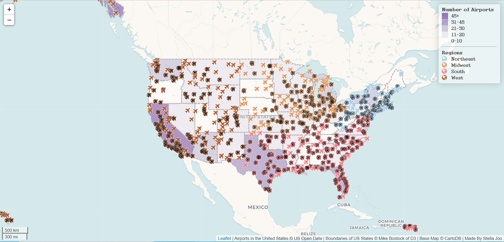

# US Airports Map 

### :memo: Introduction
This project is to map out the airports in the United States using geoJson and leaflet. This map includes the legend and scale bar for respective elements on the map.
### :pushpin: Primary functions

The airplanes on the map represent each airport in the United States. They are classified as 4 groups based on the regions - **Northeast, Midwest, South, and West**. When the user clicks the airplane, it pops up the simple location of the airport (city, state).

The basemap uses leaflet's open source basemap with the sequential color ramp of purples. This *difference in colors* tells which state has the highest number of airports and which state has less.

There are bullseye icons on the map, which locate where the control towers are.

The legend has information about how the data was grouped.

Generally, it seems like coastal areas have more airports than the inner areas. There's also a big difference in number of airports between West and East.
### :speech_balloon: Credits
- geoJson files
  - airports.geojson is converted from a shapefile downloaded from <a href="https://catalog.data.gov/dataset/usgs-small-scale-dataset-airports-of-the-united-states-201207-shapefile"> here </a>
  - us-state.geojson is from Mike Bostock of D3. Have more information about Mike Bostock <a href="https://bost.ocks.org/mike/"> here </a>.
- basemap: Leaflet's tileLayer
  - <a href= "'https://{s}.basemaps.cartocdn.com/rastertiles/voyager/{z}/{x}/{y}{r}.png">https://{s}.basemaps.cartocdn.com/rastertiles/voyager/{z}/{x}/{y}{r}.png</a>
- library
  - leaflet.ajax
  - chorma.js
- Icons and fonts
  - Font Awesome 4.7.0
  - Google fonts
